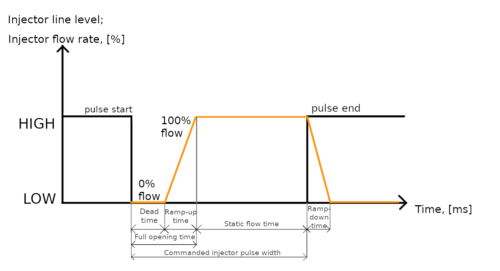
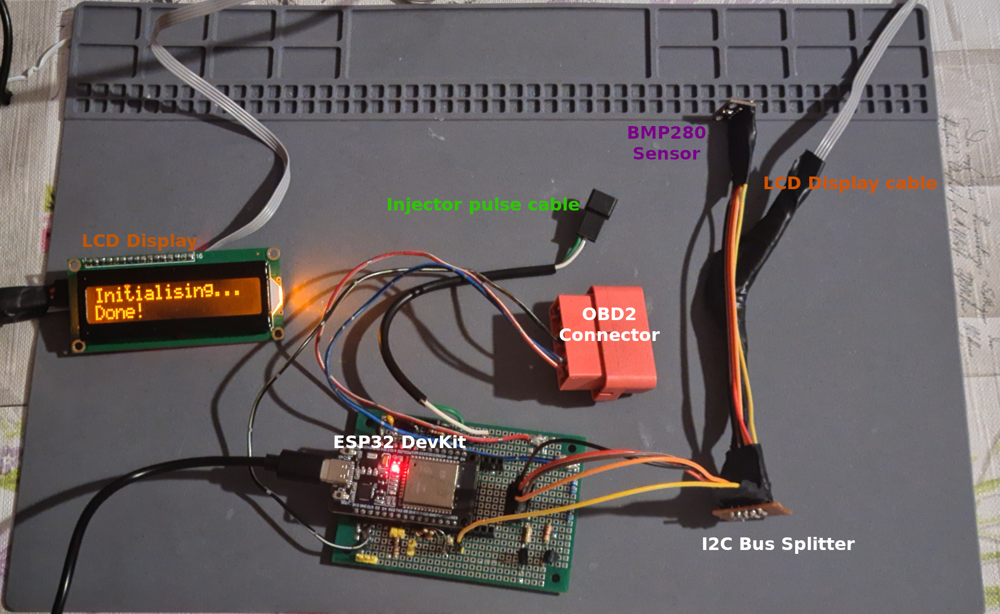

# ESP32 Corsa Fuel Meter

This project is a hardware + software solution for **real-time petrol fuel consumption and engine monitoring** using an **ESP32** microcontroller. It combines **OBD-II ISO9141-2/KWP2000** communications for engine/car data with injector pulse width measurements to calculate live fuel usage. A web interface and LCD display allow easy access to live data. Originally built and tested on a **2005 Opel Corsa C**, but adaptable to many 1996–2004 gasoline MPI cars using ISO9141-2/KWP protocols.

## Features

- Real-time fuel consumption calculations;
- OBD-II ISO9141-2 / KWP2000 communications for engine parameters;
- Web interface (served by ESP32) with 4 data pages:
  -  **Comms** (live engine/car data obtained over OBD-II);
  -  **Debug fuel** (fuel spent/distance travelled, injector pulse debug data, ambient temperature/pressure);
  -  **Fuel** (Instantaneous/Average fuel consumption, price of fuel toggle, persistent data storage across resets);
  -  **ESP32 Logs** (Info, Warning, Error, as per the [esp_logs_to_web](https://github.com/Georgi9060/esp_logs_to_web) example).
- LCD display for browser-free monitoring;

## Principle of Operation

To calculate fuel consumption in the unit of Litres per 100 km, two variables are required: fuel consumed (in L) and distance travelled (in km).

**Distance travelled** is obtained by integrating vehicle speed over time:

$$
S(t) = \int_a^b v(t)\, dt
$$

If we sample at a set interval, it is safe to assume the distance travelled during that period is equal to the average speed, multiplied by the time period:

$$
S = v_a*t
$$

In the case of this project, speed is sampled every **600 ms** (the choice is **not** arbitrary, this is the minimum time taken for a set of OBD-II requests + handling of the incoming car/pulse data and sending it out). This means the distance travelled can be calculated as:

$$
S = v_a*0.600
$$

where *v_a* is in [m/s].

Example:
```
S = 10 [m/s] * 0.600 [s] = 6 [m]
```
This means that if the sampled vehicle speed is 10 [m/s] (36 [km/h]), we calculate the travelled distance as 6 [m] over a 0.6 [s] period.

**Fuel consumed** is obtained by sampling injector pulse width and count, then assigning a fuel amount per spray event, and accumulating the consumed fuel over a time period.

Injector spray events are detected through GPIO interrupts on the injector power line - the line is normally HIGH; when the ECU commands an injector pulse, it drives the line LOW and current passes through the injector coil, producing a magnetic force and opening the injector, then, once the ECU ends the pulse, it drives the line HIGH once more. The coil discharges and a mechanical spring returns the injector needle to the closed position.

The GPIO interrupts happen on either edge (rising or falling), so that the start and end times of the injector pulse are recorded. Obtaining the pulse width is a matter of simple subtraction of the start time from the end time:

$$
t_p = t_e - t_s
$$

Once we have the injector pulse width, we can estimate the actual fuel injected during the injection event, using some experimentally obtained times and parameters of the fuel injectors in question.

The parameters required to build a reasonably accurate model of the fuel flow as a function of pulse width are:
- Static flow rate at a given pressure delta across the injector, [μL/ms];
- Current pressure delta across the injector, [bar];
- Full injector opening time (time taken from start of electrical pulse to 100% open injector), [ms];
- Full injector closing time (time taken from end of electrical pulse to 100% closed injector), [ms];
- Injector dead time (time taken from start of electrical pulse to non-zero% open injector), [ms];
- Injector ramp-up time (time taken from non-zero% open injector to 100% open injector), [ms]:
```
Injector ramp-up time = Full injector opening time - Injector dead time
```
- Injector ramp-down time (time taken from end of electrical pulse to 100% closed injector, same as Full injector closing time), [ms].

The static flow rate at an arbitrary given pressure delta across the injector follows the following law:

$$
Q_1 = Q_0  \cdot  \sqrt{\frac{\Delta P_1}{\Delta P_0}}
$$

where:

- Q_0 = injector flow at reference pressure Delta P_0;
- Q_1 = injector flow at new pressure Delta P_1;
- Delta P = P_rail - P_downstream.

Once we have the static flow rate at the given pressure delta, we can calculate the total fuel sprayed, using the following model of the fuel flow rate as a function of pulse width:



The fuel injected during the pulse is the area under the graph - consisting of the ramp-up triangle, the static flow rectangle and the ramp-down triangle. In the case of very short pulses where 100% flow is not achieved, the area becomes just a ramp-up and ramp-down triangle with areas a fraction of the full ramp-up/ramp-down triangles' areas. For more in-depth information, see ```get_pulse_fuel()``` in ```fm_tasks.c```.

The calculated fuel amount per injector pulse is added to a sum for a given period (600 ms), and in this way, having both the distance travelled and fuel consumed, we can calculate instantaneous (for the last 600 ms) as well as average (accumulated distance/fuel since start of measuring period) fuel consumption with every update.

## Hardware Setup

The system is built around an ESP32 running ESP-IDF, interfacing with:

- OBD-II port (ISO9141-2 / KWP);
- Injector line (for injector pulse width measurements);
- LCD display.

Components:

- ESP32-WROOM-32 DevKit V1;
- HD44780 1602 LCD Display with PCF8574T I2C backpack;
- BMP280 Digital Pressure Sensor;
- Wiring and connections, shown in [diagrams/photos](./docs/hardware/).



## Software

The application is developed in ESP-IDF v5.5.1 and provides:

- OBD-II Communications over ISO9141-2/KWP, as per the [OBD9141_C_Core ](https://github.com/Georgi9060/OBD9141_C_Core) library;
- Fuel injector signal processing through GPIO interrupts;
- WebSocket server for live data streaming;
- Web dashboard (HTML/JS/CSS, served from ESP32 flash);
- Persistent data storage of accumulated fuel consumption with NVS;
- Logging output accessible on both serial and webpage.

The application uses FreeRTOS scheduling for the fuel metering, webpage updates and display updates tasks.

## Usage

If you wish to replicate this setup, make sure to do the following:

1. Build the physical connections, as per the wiring diagrams;
2. Change the coefficients which differ in your car's engine/injectors in the ```phys_const.h``` header file;
3. Change the pins which differ on your microcontroller in the ```fm_tasks.h``` header file;
4. Change the Wi-Fi Access Point's **SSID** and **password** in the ```set_up_wifi.h``` header file, or set up Wi-Fi on the ESP32 as a station instead, as per the [ESP-IDF Wi-Fi station](https://github.com/espressif/esp-idf/tree/master/examples/wifi/getting_started/station) example;
5. Build and flash:
```
idf.py build flash monitor
```
6. After flashing, connect to the Wi-Fi Access Point with the correct credentials, then check the serial monitor for the ESP32’s IP address:
```
I (1065) wifi softAP: wifi_init_softap finished. SSID:Fuel Meter password:mypassword channel:6
I (1067) esp_netif_lwip: DHCP server started on interface WIFI_AP_DEF with IP: 192.168.4.1
```
7. Open a browser and go to:
```
http://192.168.4.1/index.html
```
8. You should see the webpage with links to the four data pages. The ESP32 will send the appropriate data to the webpage via WebSocket every 600 ms.

## Compatibility

-  **Tested:** Opel/Vauxhall Corsa C (2005), engine code Z12XEP;
-  **Expected support:** 1996–2004 gasoline MPI vehicles using ISO9141-2 or KWP2000 OBD-II;
-  **Not supported:** Diesel engines, direct injection petrol, CAN-only vehicles (2008+ EU).

## Screenshots and Photos

(screenshot of each page of the website with live correct data, photo of the LCD display in the 3D box)

## License

This project is licensed under the GNU GPLv3.
See [LICENSE](LICENSE.md) for full details.
Some source files include third-party code under the MIT License.
These files retain their original license notices, and their inclusion
does not affect the project’s overall GPL licensing.

## Credits

The idea for this project originally started as the solution to a personal pet peeve due to the lack of a dedicated fuel consumption indicator in my 2005 Opel Corsa, leading to estimating the urban fuel consumption to be anywhere between 6 and 12 L/100 km, due to only having a simple fuel tank level indicator, which shifts wildly with road surface slope. It then went on to become the point of interest during my mandatory summer internship from TU-Varna, and afterwards bled into my entire summer's schedule, eventually becoming less of a *pro forma* hobby/university project and more of a fully fledged fuel consumption and engine monitoring system, akin to something one may find in a production vehicle, or as an aftermarket product. For this to become possible, the following people's support, time and insights have been invaluable:

-  **Assistant Professor Stoyan Stoyanov, PhD** - who provided input on building the circuits for KWP communications and injector pulse measurements, supplied cables and connectors for the custom wiring, gave access to the university's petrol injector testing stand, along with general project guidance on designing, building, prototyping and testing the system throughout its development;
-  **Associate Professor Veselin Mihaylov, PhD** - who assisted greatly in mounting/dismounting components when testing my Corsa's injectors and installing the injector cable permanently, supplied the oscilloscope and probes used for monitoring behaviour, and spent two entire days' worth of their time selflessly helping me with my ambitious goal of creating this fuel meter;
-  **Aaron Walsh, Electronics and Software Consultant - PHAB Design Ltd** - who answered my lengthy email where I questioned an apparent anomaly in fuel injected vs injector pulse width;
-  **[Ivor Wanders](https://github.com/iwanders)** - for creating the original [OBD9141 Arduino library](https://github.com/iwanders/OBD9141), which I later ported to C and have used in this project ([OBD9141_C_Core](https://github.com/Georgi9060/OBD9141_C_Core));
- And last but not least, my wonderful girlfriend and future wife **Radostina**, who persevered throughout the hundreds of hours of screentime I accumulated working on this project, cooked tens of delicious meals for me to have while researching and debugging, and was always there to greet me when I came back from testing on the car with either a grin from ear to ear or a poker face.